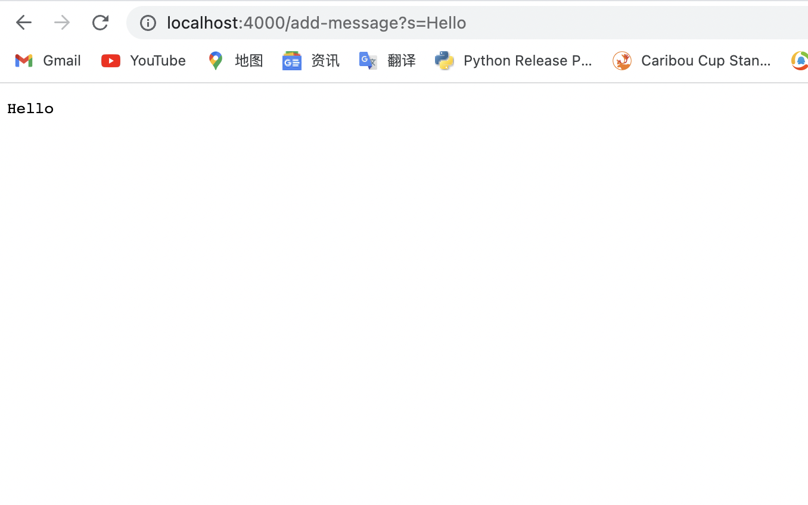
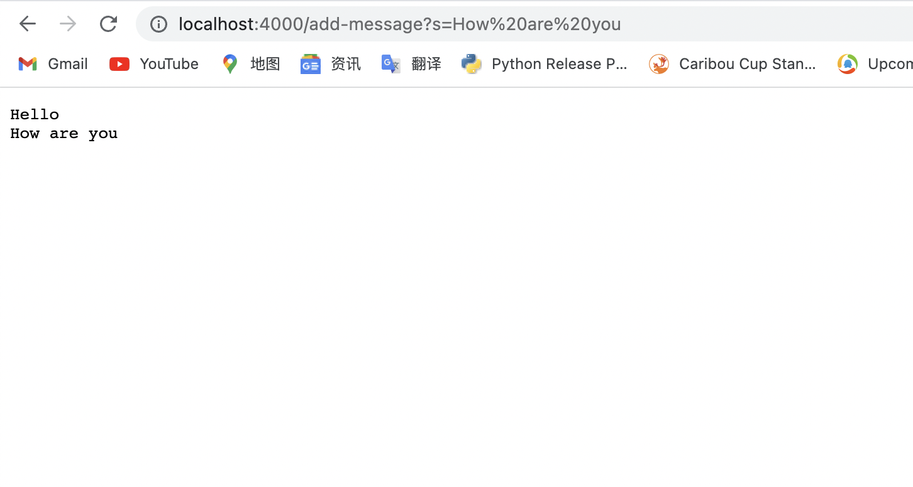
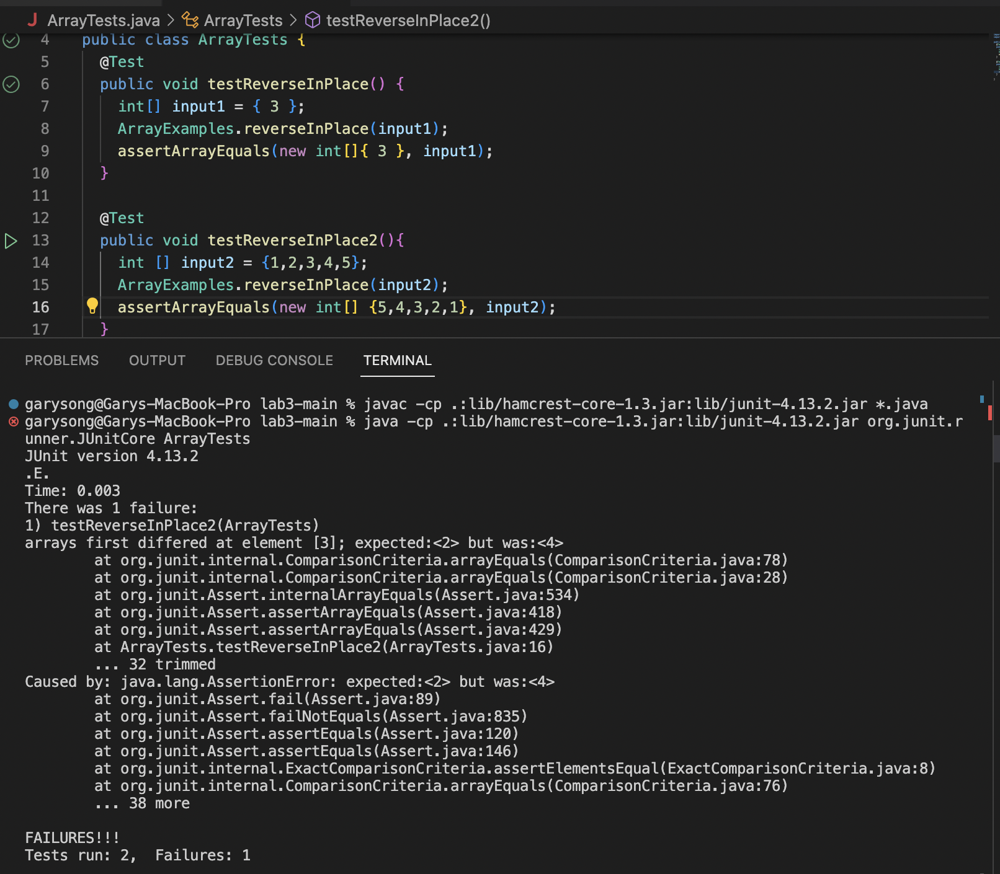

# Lab Report 2 - Servers and Bugs
## Part 1 
#### Here is my code of `StringServer`.

        import java.io.IOException;
        import java.net.URI;
        import java.util.ArrayList;

        class Handler implements URLHandler {
            // The one bit of state on the server: a number that will be manipulated by
            // various requests.
            ArrayList<String> list = new ArrayList<String>();
            String res = "";

            /* (non-Javadoc)
            * @see URLHandler#handleRequest(java.net.URI)
            */
            public String handleRequest(URI url) {
                if (url.getPath().equals("/add-message")) {
                    String[] para = url.getQuery().split("=");
                    if(para[0].equals("s")){
                        list.add(para[1]);
                        res += list.get(list.size()-1)+ "\n";
                        return res;
                    }
                    else{
                        return "404 NOT FOUND";
                    }
                }else{
                    return "404 NOT FOUND";
                }
                }
            }
            public class StringServer {
                public static void main(String[] args) throws IOException {
                    if(args.length == 0){
                        System.out.println("Missing port number! Try any number between 1024 to 49151");
                        return;
                    }

                    int port = Integer.parseInt(args[0]);

                    Server.start(port, new Handler());
            }
    
            }

#### * After finishing the codes, I just compile and run the codes by using `javac Server.java StringServer.java ` and `java StringServer 4000` in terminal.
 
#### * When I put the requests that is `/add-message?s=Hello`, I get the page that show `Hello`.
 
 
#### * When I put the requests that is `/add-message?s=How are you`, I get the page that `Hello` is in the first line, and `How are you` is in the second line.
 
 
#### * Both of the requests in the two screenshots trigger the same process of the functions. 
* `list` is an arraylist that stores all of the string part of inputs.
* `res` is an empty string, to represent the current string part of current input.
* `url` is the parameter that is the user's input.(It is the form of `/add-message?s=<string>`)

#### * After we inputing the `url` that is the parameter of `handleRequest`, we find both of the requests have `"/add-message"`, so we enter the if condition. We make split the `url` with two parts by `=`. If `"s"` is in the left side of `=` which is the `para[0]`, we just add the right side which is the `para[1]` to the `list`. Finally we will return the current string part of the user's input that is `res`, and make an new line for next input.
 

## Part 2

### * A failure-inducing input
        @Test
        public void testReverseInPlace2(){
            int [] input2 = {1,2,3,4,5};
            ArrayExamples.reverseInPlace(input2);
            assertArrayEquals(new int[] {5,4,3,2,1,}, input2);
        }

### * An input that doesn’t induce a failure
	    @Test 
	    public void testReverseInPlace() {
                int[] input1 = { 3 };
                ArrayExamples.reverseInPlace(input1);
                assertArrayEquals(new int[]{ 3 }, input1);
	    }

### * The symptom

### * The bug(before fixing)
        // Changes the input array to be in reversed order
        static void reverseInPlace(int[] arr) {
            for(int i = 0; i < arr.length; i += 1) {
              arr[i] = arr[arr.length - i - 1];
            }
        }

### * The bug(after fixing)
        // Changes the input array to be in reversed order
        static void reverseInPlace(int[] arr) {
            int [] NewArr = new int[arr.length];
            for(int i = 0; i < arr.length; i += 1) {
                NewArr[i] = arr[i];
            }
            for(int i = 0; i < arr.length; i += 1){
            arr[i] = NewArr[arr.length - i - 1];
            }
        }

* For this `reverseInPlace` method, the issue is that the current input was being replaced by the new input that we put, which causes we can not use the old input to make the reverse order. We fix the issue by add an new array to store the current input that is the old input. After we deal with the new input, we can still move the old input to make the reverse order.

## Part3

In week 2, it is the first time I understood how to build and run the Server. I also learned how to run the Server on a remote computer, and implmented a web server that supports a pathfor adding a new string to the list, and a path for querying the list of strings and returning a list of all strings that we needed. In week 3, it is the first time I knowed the definition of Symptoms and Failure-inducing Inputs. I also know how to debug a basic method with Junit.

### That is all for the report 
